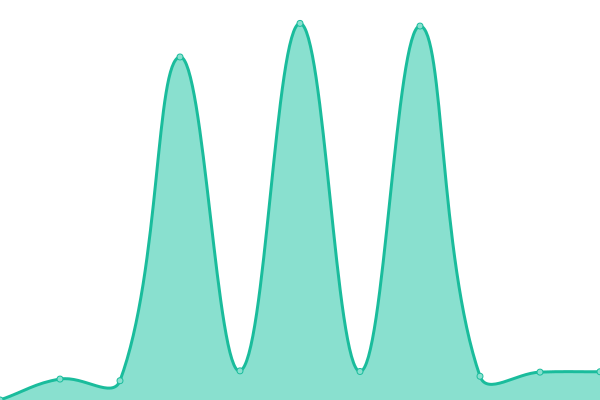

# [📈 Live Status](https://uptime.carissimi.eu): <!--live status--> **🟩 All systems operational**

This repository contains the open-source uptime monitor and status page for [Riccardo Carissimi](https://www.linkedin.com/in/rcarissimi/), powered by [Upptime](https://github.com/upptime/upptime).

With [Upptime](https://upptime.js.org), you can get your own unlimited and free uptime monitor and status page, powered entirely by a GitHub repository. We use [Issues](https://github.com/MrRiky54/upptime/issues) as incident reports, [Actions](https://github.com/MrRiky54/upptime/actions) as uptime monitors, and [Pages](https://uptime.carissimi.eu) for the status page.

<!--start: status pages-->
<!-- This summary is generated by Upptime (https://github.com/upptime/upptime) -->
<!-- Do not edit this manually, your changes will be overwritten -->
<!-- prettier-ignore -->
| URL | Status | History | Response Time | Uptime |
| --- | ------ | ------- | ------------- | ------ |
|  Lenovo | 🟩 Up | [lenovo.yml](https://github.com/MrRiky54/upptime/commits/HEAD/history/lenovo.yml) | 

 576ms
     
 | 

<a href="https://uptime.carissimi.eu/history/lenovo">100.00%</a>
    

|  NAS | 🟩 Up | [nas.yml](https://github.com/MrRiky54/upptime/commits/HEAD/history/nas.yml) | 

 1947ms
     
 | 

<a href="https://uptime.carissimi.eu/history/nas">100.00%</a>
    

|  Mail | 🟩 Up | [mail.yml](https://github.com/MrRiky54/upptime/commits/HEAD/history/mail.yml) | 

 632ms
     
 | 

<a href="https://uptime.carissimi.eu/history/mail">100.00%</a>
    

|  AVIS | 🟩 Up | [avis.yml](https://github.com/MrRiky54/upptime/commits/HEAD/history/avis.yml) | 

 1056ms
     
 | 

<a href="https://uptime.carissimi.eu/history/avis">100.00%</a>
    

<!--end: status pages-->

[**Visit our status website →**](https://uptime.carissimi.eu)

## 📄 License

- Powered by: [Upptime](https://github.com/upptime/upptime)
- Code: [MIT](./LICENSE) © [Riccardo Carissimi](https://www.linkedin.com/in/rcarissimi/)
- Data in the `./history` directory: [Open Database License](https://opendatacommons.org/licenses/odbl/1-0/)
